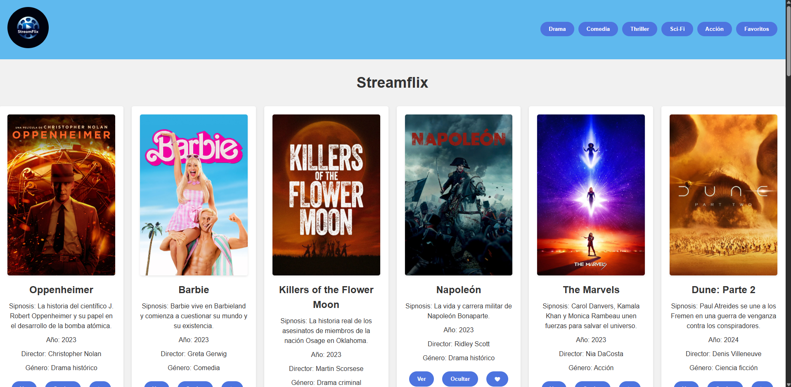
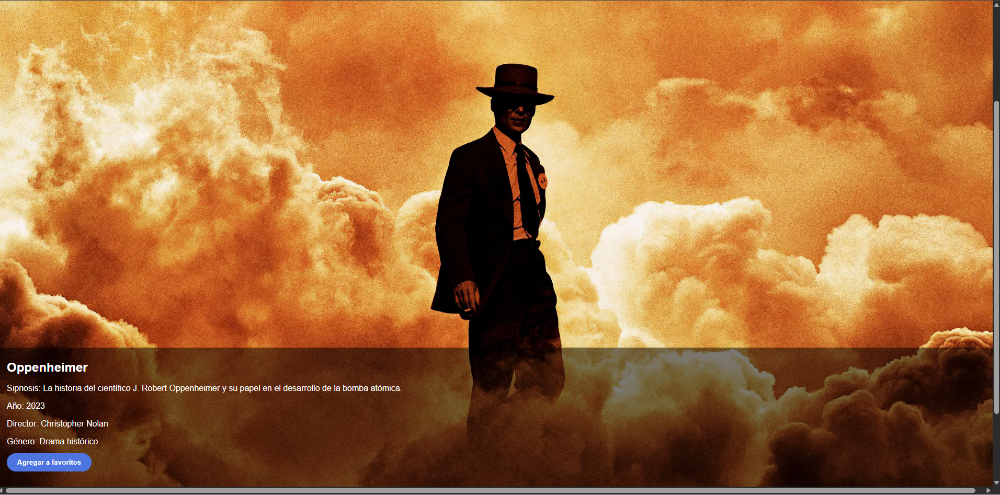
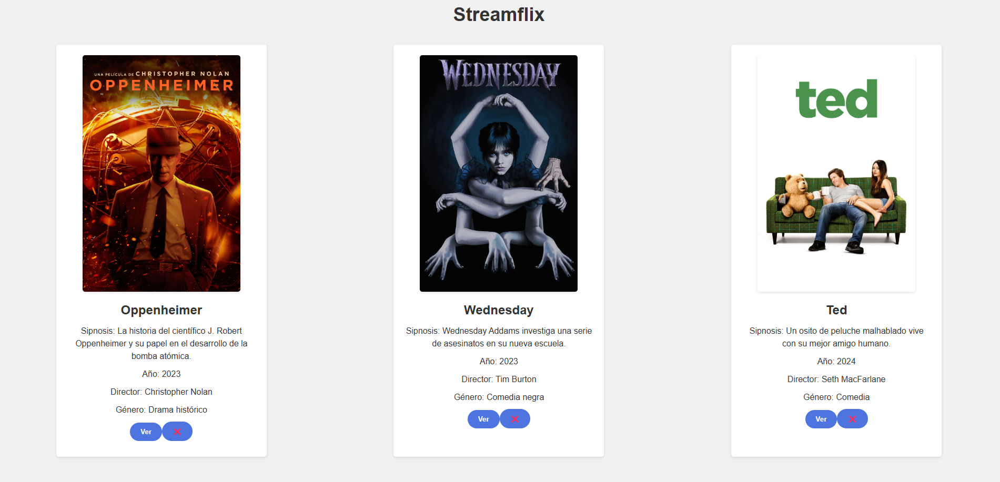
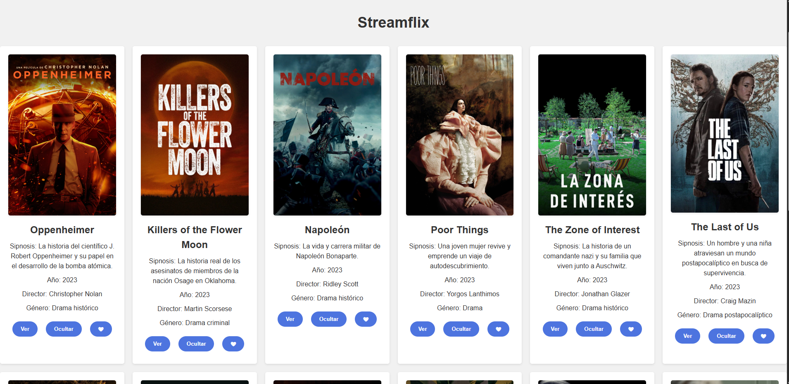
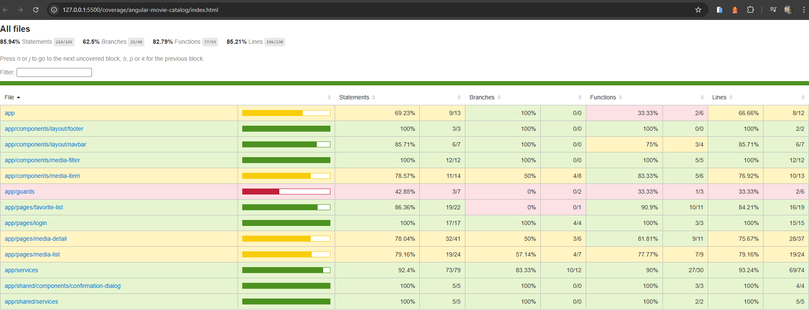
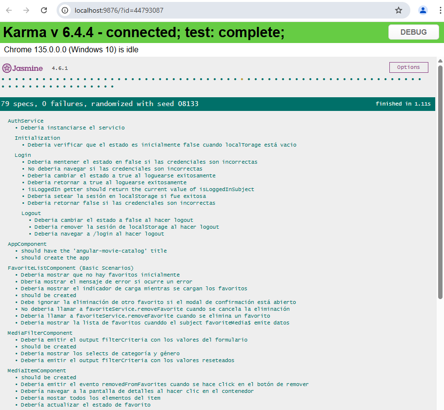
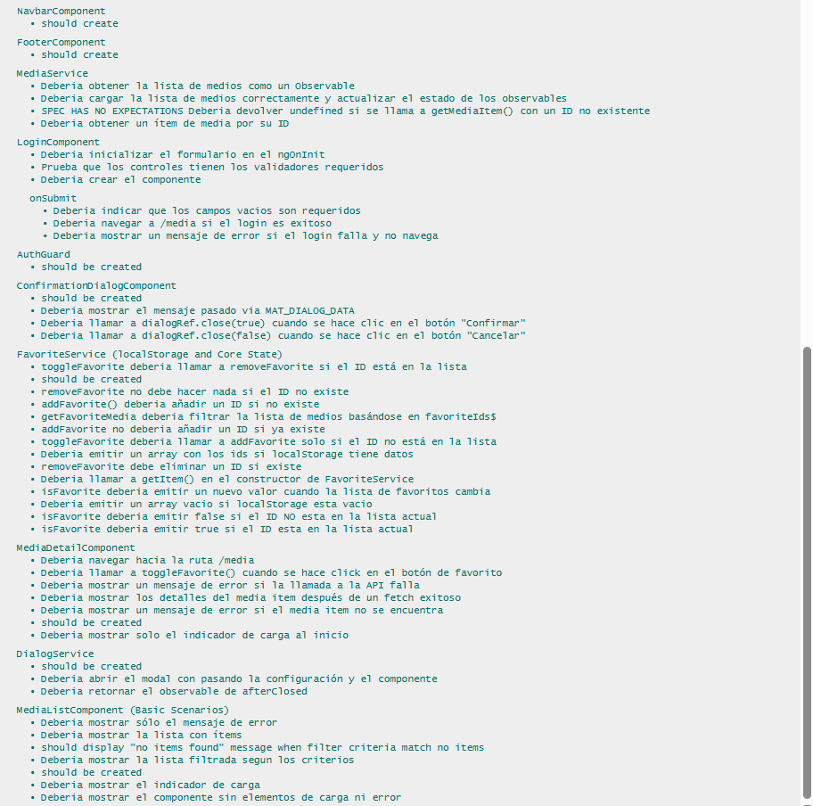

# StreamFlix
___

### Descripción
Esta app tiene como objetivo simular un hub de entretenimiento siendo desarrollado con fines de evaluación para Mega Semillero. Consiste en una página similar a lo que seria una SPA con algún framework frontend. Sin embargo esta siendo desarrollada con JavaScript Vanilla. En esta app web se muestra un cattálogo de películas y series. Cómo parte de las funcionalidades se pueden agregar o quitar de favoritos, cuenta con  una vista de detalles y un login simulado.
___

### Instrucciones de uso

Opción 1

1. Descargar repositorio desde este link: [StreamFlix](https://github.com/TrePiceno/StreamFlixApp "StreamFlix")
2. Descomprimir la carpeta descargada
3. Abrir carpeta del proyecto en Visual Studio Code
4. Ejecutar archivo *index.html*  con live server

Opción 2

1. Abrir una Visual Studio Code
2. Abrir terminal
2. Ejecutar comando con la url: *git clone https://github.com/TrePiceno/StreamFlixApp.git*
4. Ejecutar archivo *index.html* con el live server

Opción 3

1. Entrar al repositorio: [StreamFlix](https://github.com/TrePiceno/StreamFlixApp "StreamFlix")
2. Ir al *about* en el repositorio y acceder al link de la página (https://trepiceno.github.io/StreamFlixApp/)

___

### Capturas de pantalla

Wireframe del Login

Wireframe del Home

Wireframe del detalle de cada pelicula o serie

___

### Capturas de pantalla

En la primer vista tenemos un login simulado, para acceder al sitio es necesario ingresar en el campo usuario la palabra *admin* y en el campo de la contraseña *pass123*

En la vista del home, tenemos el catálogo principal del sitio.

La siguente imagen represanta la vista del detalle de la película o serie seleccionada

En esta vista tenemos aquellas películas que se añadieron a favoritos por el usuario

Por último, tenemos la vista por genero, en este caso se muestra el contenido clasificado como *drama*
___
### Proceso de desarrollo

Hice bastantes iteraciones durante el desarrollo; cree primero la estrutura del html donde se mostraría el catálogo de películas y series, pero luego tuve que integrar un segundo archivo para el login. Cree y trabajé la lógica del archivo login.js, considerando que se trata de un login simulado no me tomó mucho tiempo desarrollarlo. Luego para poder mostrar la lista en dicidí trabajar con un archivo json, el cual para añadir todas las películas y series de las que iba a disponer pedí ayuda a Gemini para la generación de todas estas y luego de varias iteraciones mientras trabaja las cards de las vistas fui implementando más propiedades al json. En uno de los planteamientos para la creación de las cards hice uso de innerHtml para usar código hmtl en el archivo js, lo cual desconocia que no era una práctica segura hasta que lo mencionó el Challenger en la última sesión por lo que decidí refactorizar y usar Dom Scripting para la creación de elementos HMTL y evitar la vulnarabilidad, aunque se trate de un sitio de práctica, considero conviente trabajar implementando buenas practicas en los proyectos. Al final, luego de trabajar toda la lógica llego el momento de dar estilos con CCS puro.

___
### Sprint Review
| ¿Qué salió bien? | ¿Qué puedo hacer diferente? | ¿Qué no salió bien? |
|------------------|:---------------------------:|--------------------:|
| Al ser una aplicación sencilla, no fue tan dificil estructurarla, a pesar de no haber planificado el proyecto.Trabajar la lógica según los requerimientos no fue tan complejo, diría que fue una buena practica para comenzar con este proyecto e ir teniendo más idea de como solventarlo. | Trabajar más en la seguridad de las aplicaciones a desarrollar. Además, una mejor pleneación de la aplicación podría resultar en menos iteraciones durante el desarrollo, si bien si puede haber refactorización de código, al menos podría ser más eficiente el proceso de desarrollo. | De momento el diseño de las cards no me convencen del todo, la posición del texto no es uniforme en las cards, a pesar de que intente usar las propiedades necesarias para solucionarlo, no resulto lo esperado, tendré que seguir intentarlo hasta lograrlo. |

___

# Sprint #2 - Migración a Angular

### Instrucciones de uso

1. Abrir una Visual Studio Code
2. Abrir terminal
2. Ejecutar comando con la url: *git clone https://github.com/TrePiceno/StreamFlixApp.git*
4. Cambiar al directorio del proyecto: cd streamflixapp
5. Ejecutar el comando *npm install* para que se instalen todas las dependencias del proyecto.
6. Levantar el servidor con el comando *ng s -o*
7. Ingresar las credenciales *admin* y *pass123* en sus respectivos campos.

Listo, ya pueden navegar por la aplicación.

#### Para el desarrollo de este proyecto se usaron las siguientes tecnologías y dependencias:

- Angular 18.2.14
- Typescript 5.5.2
- Angular Material 18.2.14
- Node JS 22.14

### Proceso de desarrollo

Como primer punto a abordar, considere tomar el consejo de agregar solo 4 películas por línea para 'facilitar' al usuario el tomar una decisión y claro, evitar tanta saturación de titulos. En ese sentido hice cambios en la UI además de eso, cambie la barra de navegación, incluyendo un botón de 'logout' y agregando solo la navegación entre vistas principales. 

Como segundo punto, implemente un sistema de filtrado, debido que en el desarrollo anterior lo quise implementar pero en esa primer instancia no creí necesario debido que se abordo por medio de botones en el navbar. Esto fue implementados en uno de los proyectos del primer curso en Udemy, el curso de Javascript, entonces lo traje a este proyecto con Angular. 

Como tercer y úlitmo punto, había tenido un acercamiento a Angular el año pasado, sin embargo, en mi carrera todo lo desarrollado fue con React JS, inclusive me tocó desarrollar en Next JS y aunque Angular tiene similitudes, al menos por ahora, me parecen mundos aparte. Me gustan las tres tecnologías. De todos modos no dejo de ser un reto retomar Angular. 

___
### Sprint Review
| ¿Qué salió bien? | ¿Qué puedo hacer diferente? | ¿Qué no salió bien? |
|------------------|:---------------------------:|--------------------:|
| Implementar de manera exitosa las funcionalidades y añadir algunas funcionalidades más, como los filtros, el modal y el logout. | Planificar el desarrollo desde el inicio. | No logré mantener el estado del login, tuve que usar LocalStorage para guardar el estado y poder mantener el sitio con autenticación. Tampoco logré el comportamiento de los enlaces, para destacar en que vista actual de la página. |

___

# Sprint #3 - Testing

### Proceso de desarrollo

En principio creí que sería sencillo comparado con el desarrollo de la aplicación. Me resulto todo un viacrucis: primero entender de que trata el testing en este framework (y en general); luego entender que escenarios se deben considerar, como casos de uso para testear; con que conceptos se trabaja si lo que se testean son observables, si se debe hacer con asincronia, si hay que simular carga de datos, el uso de mocks, stubbing, renderizado de elementos del DOM; algunas cosas me parecieron familiar, como la captura de elementos del DOM. Sinceramente, es muy denso y entiendo que solo son cosas básicas, ahora logré hacerlo, con muchas y muchas horas de probar e investigar, al final he de tener que prácticar mucho más para realmente interiorizar cada concepto, cada línea de código. Me siento saturado y solo es el principio.

### Reportes de testing

#### Code Coverage

#### Testing

 

--> imagen 1/2

--> imagen 2/2

___

### Sprint Review
| ¿Qué salió bien? | ¿Qué puedo hacer diferente? | ¿Qué no salió bien? |
|------------------|:---------------------------:|--------------------:|
| La cantidad de pruebas, sinceramente creí poder hacer muchas menos, la ventaja que algunas simplemente eran opuestas de otras y en algunos casos muy similares a otras. | Planificar el desarrollo desde el inicio. | Quizas faltan muchas pruebas de distintos escenarios, pero apenas logré hacer las que hice, con más tiempo y mayor entendimiento se podrían cubrir más escenarios. Me siento incapaz, me falta un montón por aprender. |